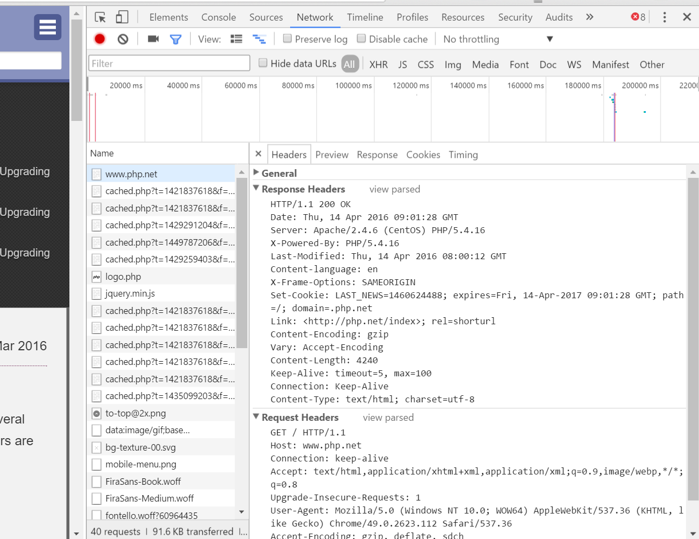

# HTTP Headers



_Select Network tab in code inspector and click on url to view headers._

The image shows the request headers sent by the browser and the received response headers
* All headers are a string of "key: value" pairs separated by a CR-LF (Carriage return \r (Mac); Line Feed \n (Linux))
* See [list of _REQUEST_ and _RESPONSE_ headers](https://en.wikipedia.org/wiki/List_of_HTTP_header_fields)
* `header()` allows us to send a raw HTTP header

```php
<?php
header("Location: http://www.php.net"); //re-direction header
exit();
```

* Must call `header()` before any other output, including whitespaces
* Headers are also set when using `cURL`:

```php
//Initialise a new session and return a _cURL handle_ (ch)
$ch = curl_init();

$headers = [];
$headers[] = 'Accept: text/plain';
$headers[] = 'Accept-Charset: utf-8';
$headers[] = 'Accept-Encoding: gzip, deflate'; //etc...

// set cURL options
curl_setopt($ch, CURLOPT_URL, "http://www.myurl.com/");
curl_setopt($ch, CURLOPT_HTTPHEADER, $headers);
//...etc

//Execute the given cURL session using the URL we've set above
$response = curl_exec($ch);

// close cURL session, and free system resources. Delete
curl_close($ch);
```

### Response Headers
* The response headers tell us what kind of data we'll get back

